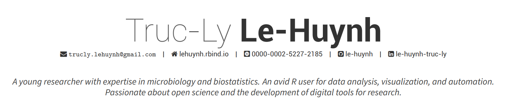

### Repo Overview

	project
	|- README.md    # the top level description of content (this doc)
	|
	|- cv_pagedown/ # CV built with [`pagedown`](https://github.com/rstudio/pagedown) R package
	|
	|- cv_vitae/    # CV built with [`vitae`](https://pkg.mitchelloharawild.com/vitae/) R package
	|
	+- data/        # data for building CV

